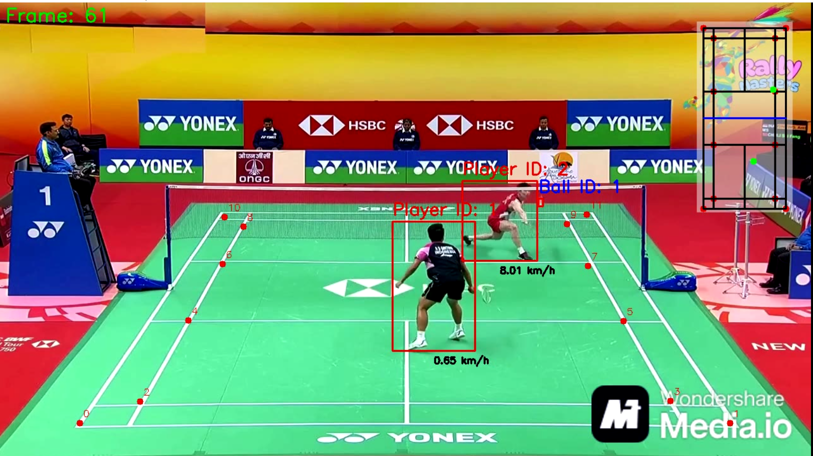

# Badminton-Analytics

### Introduction

This project analyzes tennis players in video to detect players and the shuttlecock, and to measure their movement. It uses YOLO to detect players, the shuttlecock, and court keypoints, enabling real-time tracking and 
performance analysis.

### Output Videos

### Models Used
- YOLO v8 for player detection
- Fine Tuned YOLO for shuttlecock detection
- Fine Tuned YOLO for keypoints detection
- 

### Training
- Tennis ball detetcor with YOLO: training/ball_detector_training.ipynb
- Tennis court keypoint with Pytorch: training/court_keypoints_training.ipynb
### Requirements
- python3.8
- ultralytics
- pytroch
- pandas
- numpy
- opencv
